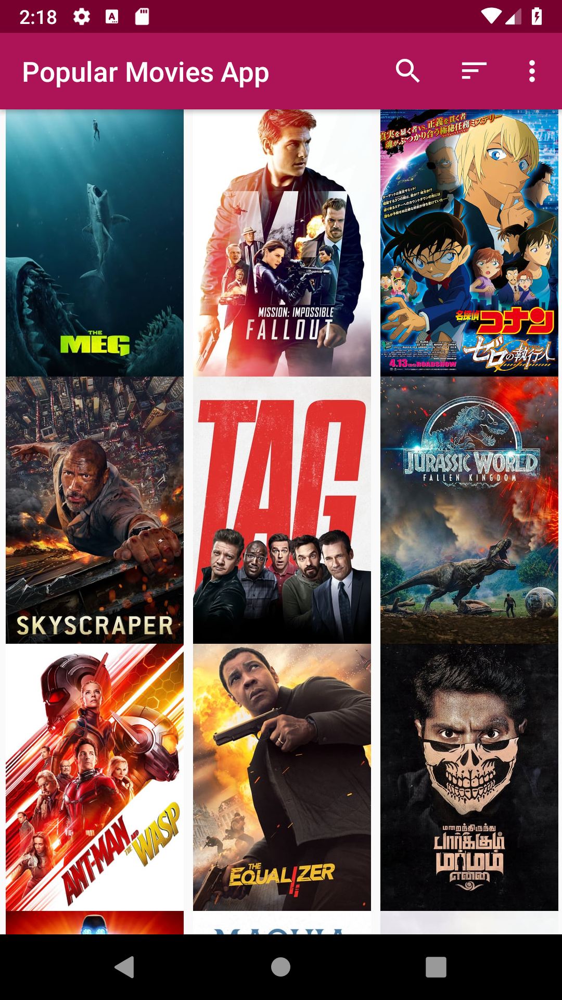
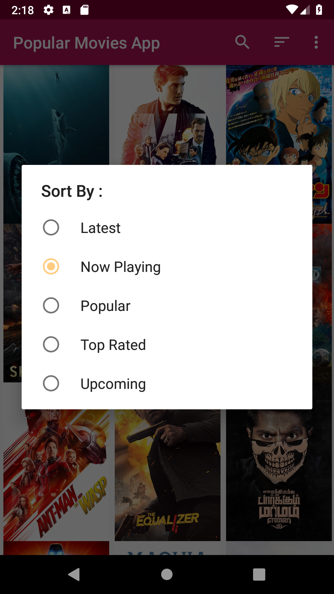
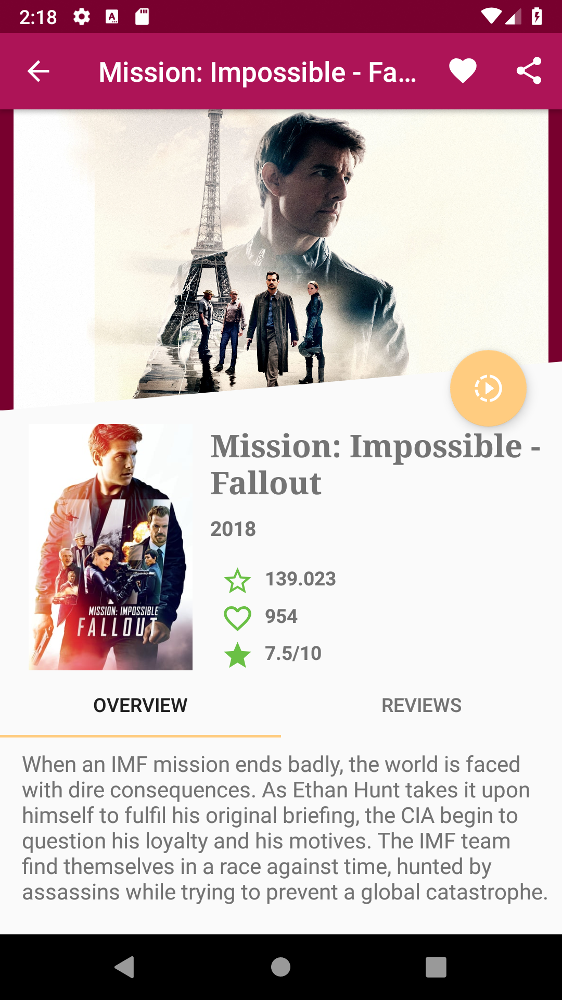
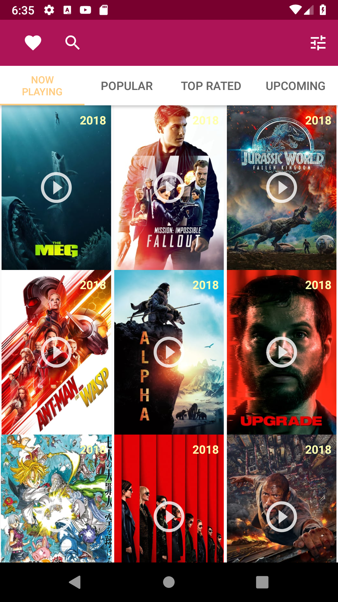
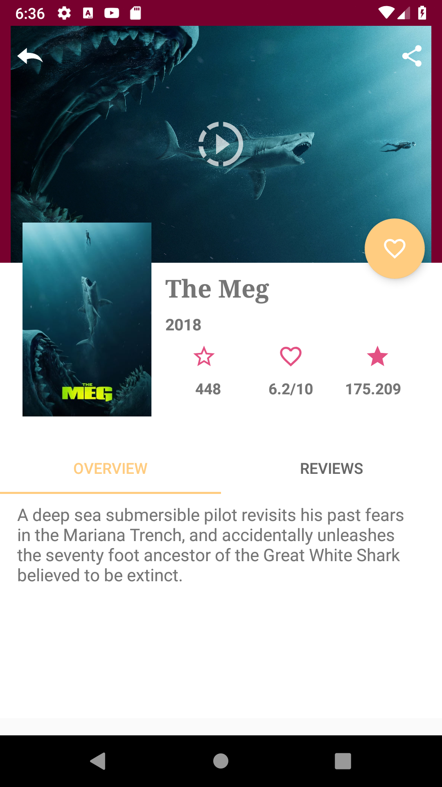
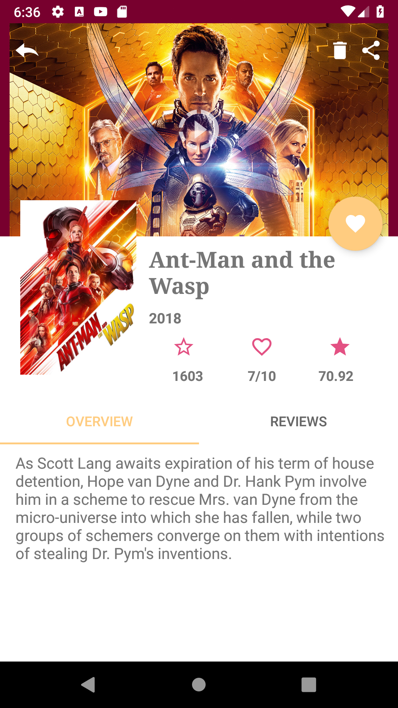

# Popular Movies App Project 

## Project Overview
This is the second project in Udacity's Android Developer Nanodegree. The purpose of this project was to built an app, optimized for tablets, to help users discover popular and highly rated movies on the web. It displays a scrolling grid of movie trailers, launches a details screen whenever a particular movie is selected, allows users to save favorites, play trailers, and read user reviews. This app utilizes core Android user interface components and fetches movie information using themoviedb.org web API. 
Most of us can relate to kicking back on the couch and enjoying a movie with friends and family. In this project, you’ll build an app to allow users to discover the most popular movies playing. We will split the development of this app in two stages.

## Why this Project?

To become an Android developer, you must know how to bring particular mobile experiences to life. Specifically, you need to know how to build clean and compelling user interfaces (UIs), fetch data from network services, and optimize the experience for various mobile devices. You will hone these fundamental skills in this project.

By building this app, you will demonstrate your understanding of the foundational elements of programming for Android. Your app will communicate with the Internet and provide a responsive and delightful user experience.

## What Will I Learn After Stage 1?

-    You will fetch data from the Internet with theMovieDB API.
-    You will use adapters and custom list layouts to populate list views.
-    You will incorporate libraries to simplify the amount of code you need to write

## Stage 1:  Main Discovery Screen, A Details View, and Settings
User Experience

In this stage you’ll build the core experience of your movies app.

Your app will:

-    Upon launch, present the user with an grid arrangement of movie posters.
-    Allow your user to change sort order via a setting:

-    The sort order can be by most popular, or by top rated

-    Allow the user to tap on a movie poster and transition to a details screen with additional information such as:

     - original title
     - movie poster image thumbnail
     - A plot synopsis (called overview in the api)
     - user rating (called vote_average in the api)
     - release date

## Screenshots
**Main Activity screenshot**  
  
**Main Activity Sort screenshot**  
  
**Detail Activity screenshot**  
  

## Stage 2: Trailers, Reviews, and Favorites
User Experience

In this stage you’ll add additional functionality to the app you built in Stage 1.

You’ll add more information to your movie details view:

-    You’ll allow users to view and play trailers ( either in the youtube app or a web browser).
-    You’ll allow users to read reviews of a selected movie.
-    You’ll also allow users to mark a movie as a favorite in the details view by tapping a button(star). This is for a local movies collection that you will maintain and does not require an API request*.
-    You’ll modify the existing sorting criteria for the main view to include an additional pivot to show their favorites collection.

## Screenshots
**Main Activity screenshot**  
  
**Movie Detail activity screenshot**  
  
**Favourite Movie Detail Activity screenshot**  
  

